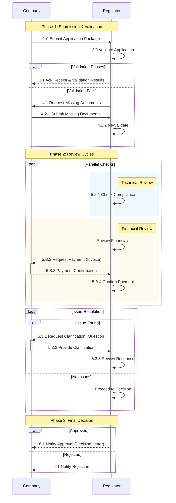

This page provides a detailed workflow example for a "shelf-life update" scenario, illustrating the process between a Company and a Regulator using APIX Tasks.

### Notification Mechanism
It is important to note that throughout this workflow, the Regulator does not directly "send" messages to the Company. Instead, the Regulator updates the `Task.status` or content of the `Task` resource on the regulator server. The Company, having subscribed to the Task, receives a notification from the regulator's Subscription service whenever a change occurs.

### Shelf-life Update Workflow

The workflow consists of three main phases: **Validation**, **Review**, and **Decision**.

#### Phase 1: Submission and Validation

**Step 1.0: Company posts a Task to the regulator (Initial Submission)** 
The company initiates the process by submitting a task with the application package. In this example, the applicaiton contains the following:
1.  Cover letter
2.  Application form
3.  Annotated label
4.  Clean label
5.  Pack mockup
6.  CMC doc #1: Drug Product: Stability Summary and Conclusions
7.  CMC doc #2: Drug Product: Stability Data
8.  CMC doc #3: Drug Product: Stability Commitment (if original section needs an update)
9.  CMC doc #4: Drug Substance: Stability Summary and Conclusions (if any new stability data/ storage period updates)
10. CMC doc #5: Drug Substance: Stability Data (if applicable)

**Step 2.0: Regulator Validates Application** 
The regulator validates the package.

*   **Scenario A: Validation Passes** (Step 3.1)
    *   Regulator updates `Task.status` to **Accepted**.
    *   Regulator attaches Acknowledgement of Receipt and Validation Results.

*   **Scenario B: Validation Fails** (Step 4.1)
    *   Regulator requests missing documents via a new Task.
    *   **Step 4.2.1**: Company submits missing documents.
    *   **Step 4.2.2**: Regulator re-validates.

#### Phase 2: Review Cycles

Once validated, the application enters the review phase. Multiple reviews may happen in parallel.

**Step 5.0: Parallel Review Tracks** 
The regulator conducts technical and administrative reviews simultaneously.

*   **Track A: Compliance Check** (Step 5.2.1)
    *   Regulator checks compliance of the scientific data.
*   **Track B: Financial Review** (New Requirement)
    *   **Step 5.B.1**: Regulator reviews financials and determines a fee is due.
    *   **Step 5.B.2**: Regulator posts a new Payment Request Task containing the Invoice.
         
        Example: <a href="Task-scenario1-03-finance-invoice.json" target="_blank">JSON Resource</a> | <a href="scenario1-03-finance-invoice.html" target="_blank">HTML Action View</a>
    *   **Step 5.B.3**: Company pays and updates the Payment Task with Proof of Payment.
         
        Example: <a href="Task-scenario1-04-finance-payment.json" target="_blank">JSON Resource</a> | <a href="scenario1-04-finance-payment.html" target="_blank">HTML Action View</a>
    *   **Step 5.B.4**: Regulator confirms payment and marks the Payment Task as **Completed**.

**Step 5.3: Issue Resolution (Loop)** 
If issues are found during review:
*   **Step 5.3.1**: Regulator posts a **Question Task** (Request for Clarification).
     
    Example: <a href="Task-scenario1-05-technical-question.json" target="_blank">JSON Resource</a> | <a href="scenario1-05-technical-question.html" target="_blank">HTML View</a>
*   **Step 5.3.2**: Company posts a **Response** to the Question Task.
     
    Example: <a href="Task-scenario1-06-technical-response.json" target="_blank">JSON Resource</a> | <a href="scenario1-06-technical-response.html" target="_blank">HTML View</a>
*   **Step 5.3.3**: Regulator reviews the response. (If satisfactory, the Question Task is marked Completed. If not, the loop continues).

#### Phase 3: Final Decision

**Step 6.0: Final Decision** 
The regulator makes a final determination.
 
Example: <a href="Task-scenario1-07-final-decision.json" target="_blank">JSON Resource</a> | <a href="scenario1-07-final-decision.html" target="_blank">HTML View</a>

---

### Workflow Diagram

