<!-- WORKFLOW DEEP-DIVE HEADER -->

  <h2 style="font-size:1.7em; font-weight:800; color:#111827; margin-bottom:10px;">Workflow Deep-Dive</h2>
  
Detailed technical walkthrough of a "shelf-life update" scenario, illustrating every FHIR resource exchange between a Company and a Regulator.

  💡
  <strong>Looking for a business-friendly overview?</strong> Start with the <a href="workflow-overview.html" style="color:#1d4ed8; font-weight:600;">Workflow Overview</a> page first.

<!-- NOTIFICATION CALLOUT -->

  
⚠️ Notification Mechanism

  
The Regulator does <strong>not</strong> directly "send" messages. Instead, it updates <code>Task.status</code> on the server. The Company receives notifications via its Subscription whenever a change occurs.

<!-- PHASE 0 -->

  

    0
    Registration &amp; Connection
  

  

    
Step 0.1 — Company Registers with Regulator

    
One-time registration with the Regulator's API portal. The Regulator registers the Company as an <code>Organization</code> and provides API credentials. The Company also registers an <code>Endpoint</code> for subscription notifications.

  

  

    
Step 0.2 — Company Connects to API

    
The Company authenticates via OAuth2, confirming authorization to post resources for their medicinal products.

  

<!-- PHASE 1 -->

  

    1
    Submission &amp; Validation
  

  

    
Step 1.0 — Company Prepares Submission

    
Granular <strong>"Index Pattern"</strong> instead of monolithic ZIP — high performance and scalability even for massive datasets.

  

  

    
Step 1.1 — Upload Binaries &amp; Bundles

    <table style="width:100%; font-size:.83em; border-collapse:collapse; margin-top:8px;">
      <thead><tr style="background:#f9fafb; text-align:left;">
        <th style="padding:8px 10px; border-bottom:1px solid #e5e7eb;">Content Type</th>
        <th style="padding:8px 10px; border-bottom:1px solid #e5e7eb;">FHIR Resource</th>
      </tr></thead>
      <tbody>
        <tr><td style="padding:8px 10px; border-bottom:1px solid #f3f4f6; color:#4b5563;">PDF Documents</td><td style="padding:8px 10px; border-bottom:1px solid #f3f4f6;"><code>Binary</code></td></tr>
        <tr><td style="padding:8px 10px; border-bottom:1px solid #f3f4f6; color:#4b5563;">Structured Labeling (JSON)</td><td style="padding:8px 10px; border-bottom:1px solid #f3f4f6;">Document <code>Bundle</code></td></tr>
        <tr><td style="padding:8px 10px; color:#4b5563;">CMC Data</td><td style="padding:8px 10px;">Transaction <code>Bundle</code></td></tr>
      </tbody>
    </table>
  

  

    
Step 1.2 — Create DocumentReferences

    
Each upload gets a <code>DocumentReference</code> — a "Library Card" with metadata and a pointer to the uploaded resource.

  

  

    
Step 1.3 — Create &amp; Post the Task

    
The <code>Task</code> is the "Orchestrator" — it holds procedure metadata and references every <code>DocumentReference</code> in <code>Task.input</code>.

    
📎 <a href="Task-scenario1-01-initial-submission.json" target="_blank" style="color:#1d4ed8;">JSON</a> · <a href="Task-scenario1-01-initial-submission.html" target="_blank" style="color:#1d4ed8;">HTML View</a>

  

  

    
Step 2.0 — Regulator Validates

    

      

        
✅ Passes

        
Status → <strong>Accepted</strong>. Receipt &amp; results attached.

        
📎 <a href="Task-scenario1-02-validation.json" target="_blank" style="color:#1d4ed8;">JSON</a> · <a href="Task-scenario1-02-validation.html" target="_blank" style="color:#1d4ed8;">HTML</a>

      

      

        
❌ Fails

        
Missing docs requested → Company re-submits → Re-validation.

      

    

  

<!-- PHASE 2 -->

  

    2
    Review Cycles
  

  
Multiple reviews happen <strong>in parallel</strong>.

  

    
Track A — Compliance Check

    
Regulator checks compliance of the scientific data.

  

  

    
Track B — Financial Review

    <ol style="font-size:.83em; color:#4b5563; line-height:1.75; padding-left:20px; margin:0 0 8px;">
      <li><strong>5.B.1</strong> — Regulator determines fee is due</li>
      <li><strong>5.B.3</strong> — Company posts proof of payment (<code>Binary</code> → <code>DocumentReference</code> → added as Task <strong>output</strong>)</li>
      <li><strong>5.B.4</strong> — Regulator verifies proof → Payment Task <strong>Completed</strong></li>
    </ol>
    
📎 <a href="Task-scenario1-04-finance-payment.json" target="_blank" style="color:#1d4ed8;">JSON</a> · <a href="Task-scenario1-04-finance-payment.html" target="_blank" style="color:#1d4ed8;">HTML View</a>

  

  

    
Step 5.3 — Issue Resolution Loop

    

      
5.3.1 — Regulator Posts Questionnaire

      
POST <code>Questionnaire</code> → <code>DocumentReference</code> → <strong>Question Task</strong> (input: DocRef)

      
📎 <a href="Task-scenario1-05-technical-question.json" target="_blank" style="color:#1d4ed8;">JSON</a> · <a href="Task-scenario1-05-technical-question.html" target="_blank" style="color:#1d4ed8;">HTML</a>

    

    

      
5.3.2 — Company Posts Response

      
POST <code>QuestionnaireResponse</code> → <code>DocumentReference</code> → added as Task <strong>output</strong>

      
📎 <a href="Task-scenario1-06-technical-response.json" target="_blank" style="color:#1d4ed8;">JSON</a> · <a href="Task-scenario1-06-technical-response.html" target="_blank" style="color:#1d4ed8;">HTML</a>

    

    

      
5.3.3 — Regulator Reviews Response

      
If satisfactory → Question Task <strong>Completed</strong> → review continues.

    

  

<!-- PHASE 3 -->

  

    3
    Final Decision
  

  

    
Step 6.0 — Final Decision

    
Regulator updates <code>Task.status</code> to <strong>completed</strong> and attaches decision documents to <code>Task.output</code>.

    
📎 <a href="Task-scenario1-07-final-decision.json" target="_blank" style="color:#1d4ed8;">JSON</a> · <a href="Task-scenario1-07-final-decision.html" target="_blank" style="color:#1d4ed8;">HTML View</a>

  

### Workflow Diagram

```mermaid
sequenceDiagram
    participant C as Company
    participant R as Regulator
    
    %% Phase 0: Registration
    Note over C,R: Phase 0: Registration & Connection
    C->>R: 0.1 Register with Regulator Portal
    R-->>C: Client Credentials & Org ID
    C->>R: 0.2 OAuth2 Authentication
    
    %% Phase 1: Submission
    Note over C,R: Phase 1: Submission & Validation
    par Upload Binaries/Bundles
        C->>R: 1.1 POST PDFs (Binary)
        C->>R: 1.1 POST Labels (Document Bundles)
        C->>R: 1.1 POST CMC (Transaction Bundles)
    end
    C->>R: 1.2 POST DocumentReferences (IDs/Links)
    C->>R: 1.3 POST Task (Orchestrator Index)
    
    activate R
    R->>R: 2.0 Validate Application
    
    alt Validation Passes
        R-->>C: 3.1 Ack Receipt & Validation Results
    else Validation Fails
        R->>C: 4.1 Request Missing Documents
        C->>R: 4.2.1 Submit Missing Documents
        R->>R: 4.2.2 Re-validate
    end
    
    %% Phase 2: Review
    Note over C,R: Phase 2: Review Cycles
    
    par Parallel Checks
        rect rgb(240, 248, 255)
            Note right of R: Technical Review
            R->>R: 5.2.1 Check Compliance
        end
        
        rect rgb(255, 250, 240)
            Note right of R: Financial Review
            R->>R: Review Financials
            Note over R: 5.B.2 Invoice Sequence
            R->>R: POST Invoice (Binary/Resource)
            R->>R: POST DocumentReference
            R->>C: POST Payment Task (Input: DocRef)
            activate C
            Note over C: 5.B.3 Payment Sequence
            C->>C: POST Proof of Payment (Binary)
            C->>C: POST DocumentReference
            C-->>R: Update Task (Add Output DocRef)
            deactivate C
            R->>R: 5.B.4 Verify Proof & Set Task: completed
        end
    end
    
    loop Issue Resolution
        alt Issue Found
            Note over R: 5.3.1 Question Sequence
            R->>R: POST Questionnaire
            R->>R: POST DocumentReference
            R->>C: POST Question Task (Input: DocRef)
            activate C
            Note over C: 5.3.2 Response Sequence
            C->>C: POST QuestionnaireResponse
            C->>C: POST DocumentReference
            C-->>R: Update Task (Add Output DocRef)
            deactivate C
            R->>R: 5.3.3 Review & Set Task: completed
        else No Issues
            R->>R: Proceed to Decision
        end
    end
    
    %% Phase 3: Decision
    Note over C,R: Phase 3: Final Decision
    
    alt Approved
        R-->>C: 6.1 Notify Approval (Decision Letter)
    else Rejected
        R-->>C: 7.1 Notify Rejection
    end
    deactivate R
```

