This page provides a detailed workflow example for a "shelf-life update" scenario, illustrating the process between a Company and a Regulator using APIX Tasks.

### Notification Mechanism

  
Important

  
Throughout this workflow, the Regulator does not directly "send" messages to the Company. Instead, the Regulator updates the <code>Task.status</code> or content of the <code>Task</code> resource on the regulator server. The Company, having subscribed to the Task, receives a notification from the regulator's Subscription service whenever a change occurs, including when Tasks are created.

### Shelf-life Update Workflow

The workflow consists of three main phases: **Validation**, **Review**, and **Decision**.

#### Phase 0: Registration and Connection

**Step 0.1: Company Registers with Regulator** 
Before any submission can occur, the Company performs a one-time registration with the Regulator's API portal. The Regulator registers the Company as an `Organization` resource and provides the necessary API credentials (e.g., OAuth2 Client ID and Secret). The Company also registers an `Endpoint`, a FHIR Resource which contains the url for the actual endpoint where subscription notifications should be sent.

**Step 0.2: Company Connects to API** 
The Company authenticates and establishes a connection to the Regulator's FHIR server. This confirms that the Company is authorized to post resources for their medicinal products.

#### Phase 1: Submission and Validation

**Step 1.0: Company Prepares and Posts Submission (Initial Submission)** 
Instead of a monolithic ZIP file, the Company follows a granular "Index Pattern" to submit the application. This ensures high performance and scalability even for massive datasets.

**Step 1.1: Upload Binaries and Bundles** 
The Company posts each component of the submission to the regulator server. Depending on the format, they use different FHIR resources:
*   **PDF Documents** (e.g., Cover Letter, Application Form, Pack Mockup) are posted as `Binary` resources.
*   **Structured Labeling** (Clean and Annotated JSON) are posted as **Document Bundles** (specifically `document` type Bundles containing ePI resources).
*   **CMC Data** (Stability Summary and Data) are posted as **Transaction Bundles** (logically grouping individual CMC data resources).

**Step 1.2: Create DocumentReferences** 
For each uploaded resource from Step 1.1, the Company creates a `DocumentReference`. The `DocumentReference` acts as a "Library Card," containing metadata (type, CTD section) and a pointer (`attachment.url`) to the server-assigned ID of the Binary or Bundle.

**Step 1.3: Create and Post the Task** 
Finally, the Company creates a `Task` resource. This Task serves as the "Orchestrator." It contains the procedure metadata and references the `DocumentReference` resources created in Step 1.2 in its `Task.input` field.

Example: <a href="Task-scenario1-01-initial-submission.json" target="_blank">JSON Resource</a> | <a href="scenario1-01-initial-submission.html" target="_blank">HTML Action View</a>

**Step 2.0: Regulator Validates Application** 
The regulator validates the package.

*   **Scenario A: Validation Passes** (Step 3.1)
    *   Regulator updates `Task.status` to **Accepted**.
    *   Regulator attaches Acknowledgement of Receipt and Validation Results.
    *   Example: <a href="Task-scenario1-02-validation.json" target="_blank">JSON Resource</a> | <a href="scenario1-02-validation.html" target="_blank">HTML Action View</a>

*   **Scenario B: Validation Fails** (Step 4.1)
    *   Regulator requests missing documents via a new Task.
    *   **Step 4.2.1**: Company submits missing documents.
    *   **Step 4.2.2**: Regulator re-validates.

#### Phase 2: Review Cycles

Once validated, the application enters the review phase. Multiple reviews may happen in parallel.

**Step 5.0: Parallel Review Tracks** 
The regulator conducts technical and administrative reviews simultaneously, all of which are through creation of a Task with the `Task.owner` as the Organzation responsible for completeing or responding to the Task.

*   **Track A: Compliance Check** (Step 5.2.1)
    *   Regulator checks compliance of the scientific data.
*   **Track B: Financial Review** (Step 5.B.1)
    *   **Step 5.B.1**: Regulator reviews financials and determines a fee is due.
    *   **Step 5.B.3**: Company performs the payment.
        1. Company posts the proof of payment (PDF `Binary`).
        2. Company creates a `DocumentReference` for the proof of payment.
        3. Company updates the **Payment Task** by adding the `DocumentReference` as an **output** (status remains `in-progress`).
         
        Example: <a href="Task-scenario1-04-finance-payment.json" target="_blank">JSON Resource</a> | <a href="scenario1-04-finance-payment.html" target="_blank">HTML Action View</a>
    *   **Step 5.B.4**: Regulator verifies the output proof and updates the **Payment Task** status to **Completed**.

**Step 5.3: Issue Resolution (Loop)** 
If issues are found during technical review:
*   **Step 5.3.1**: Regulator posts a **Questionnaire** (Request for Clarification).
    1. Regulator posts the `Questionnaire` (JSON) to the server.
    2. Regulator creates a `DocumentReference` for the Questionnaire.
    3. Regulator creates a **Question Task** with the `DocumentReference` as an **input**.
     
    Example: <a href="Task-scenario1-05-technical-question.json" target="_blank">JSON Resource</a> | <a href="scenario1-05-technical-question.html" target="_blank">HTML View</a>
*   **Step 5.3.2**: Company posts a **Response** to the Question Task.
    1. Company posts a `QuestionnaireResponse` (JSON) to the server.
    2. Company creates a `DocumentReference` for the response.
    3. Company updates the **Question Task** by referencing the response in the **output** (status remains `in-progress`).
     
    Example: <a href="Task-scenario1-06-technical-response.json" target="_blank">JSON Resource</a> | <a href="scenario1-06-technical-response.html" target="_blank">HTML View</a>
*   **Step 5.3.3**: Regulator reviews the response. (If satisfactory, the Regulator marks the Question Task as **Completed** and the main review continues).

#### Phase 3: Final Decision

**Step 6.0: Final Decision** 
The regulator makes a final determination, indicating the inital `Task.status` complete and adding documents to the `Task.ouput`.
 
Example: <a href="Task-scenario1-07-final-decision.json" target="_blank">JSON Resource</a> | <a href="scenario1-07-final-decision.html" target="_blank">HTML View</a>

---

### Workflow Diagram

```mermaid
sequenceDiagram
    participant C as Company
    participant R as Regulator
    
    %% Phase 0: Registration
    Note over C,R: Phase 0: Registration & Connection
    C->>R: 0.1 Register with Regulator Portal
    R-->>C: Client Credentials & Org ID
    C->>R: 0.2 OAuth2 Authentication
    
    %% Phase 1: Submission
    Note over C,R: Phase 1: Submission & Validation
    par Upload Binaries/Bundles
        C->>R: 1.1 POST PDFs (Binary)
        C->>R: 1.1 POST Labels (Document Bundles)
        C->>R: 1.1 POST CMC (Transaction Bundles)
    end
    C->>R: 1.2 POST DocumentReferences (IDs/Links)
    C->>R: 1.3 POST Task (Orchestrator Index)
    
    activate R
    R->>R: 2.0 Validate Application
    
    alt Validation Passes
        R-->>C: 3.1 Ack Receipt & Validation Results
    else Validation Fails
        R->>C: 4.1 Request Missing Documents
        C->>R: 4.2.1 Submit Missing Documents
        R->>R: 4.2.2 Re-validate
    end
    
    %% Phase 2: Review
    Note over C,R: Phase 2: Review Cycles
    
    par Parallel Checks
        rect rgb(240, 248, 255)
            Note right of R: Technical Review
            R->>R: 5.2.1 Check Compliance
        end
        
        rect rgb(255, 250, 240)
            Note right of R: Financial Review
            R->>R: Review Financials
            Note over R: 5.B.2 Invoice Sequence
            R->>R: POST Invoice (Binary/Resource)
            R->>R: POST DocumentReference
            R->>C: POST Payment Task (Input: DocRef)
            activate C
            Note over C: 5.B.3 Payment Sequence
            C->>C: POST Proof of Payment (Binary)
            C->>C: POST DocumentReference
            C-->>R: Update Task (Add Output DocRef)
            deactivate C
            R->>R: 5.B.4 Verify Proof & Set Task: completed
        end
    end
    
    loop Issue Resolution
        alt Issue Found
            Note over R: 5.3.1 Question Sequence
            R->>R: POST Questionnaire
            R->>R: POST DocumentReference
            R->>C: POST Question Task (Input: DocRef)
            activate C
            Note over C: 5.3.2 Response Sequence
            C->>C: POST QuestionnaireResponse
            C->>C: POST DocumentReference
            C-->>R: Update Task (Add Output DocRef)
            deactivate C
            R->>R: 5.3.3 Review & Set Task: completed
        else No Issues
            R->>R: Proceed to Decision
        end
    end
    
    %% Phase 3: Decision
    Note over C,R: Phase 3: Final Decision
    
    alt Approved
        R-->>C: 6.1 Notify Approval (Decision Letter)
    else Rejected
        R-->>C: 7.1 Notify Rejection
    end
    deactivate R
```

